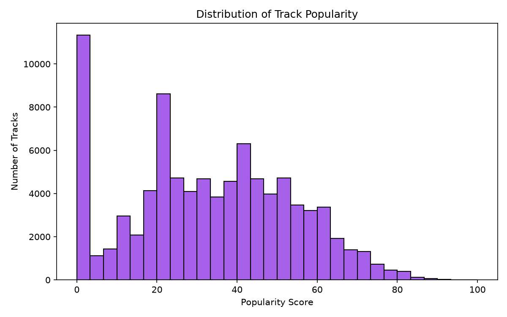
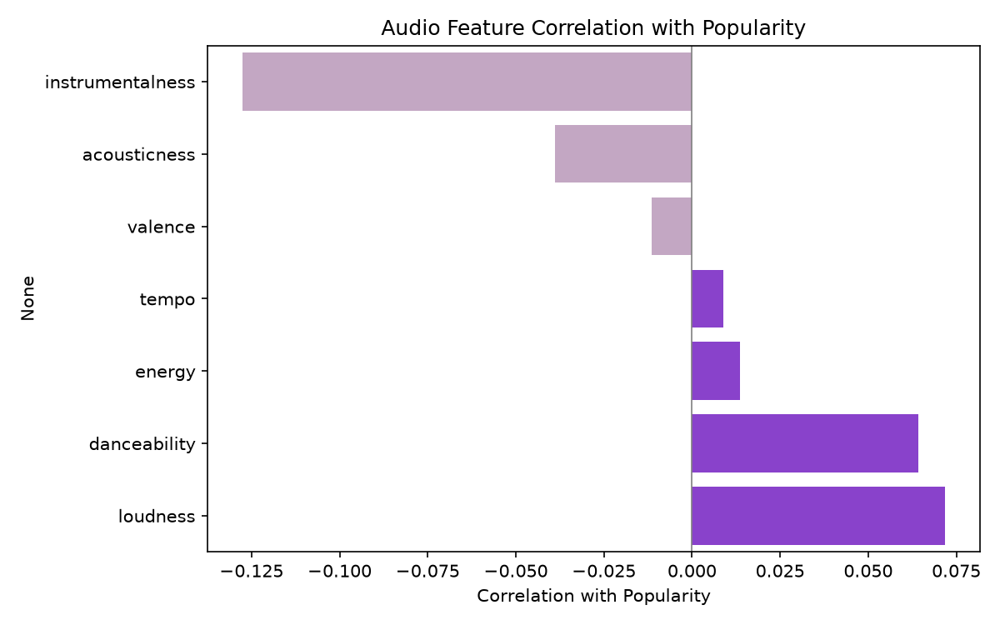
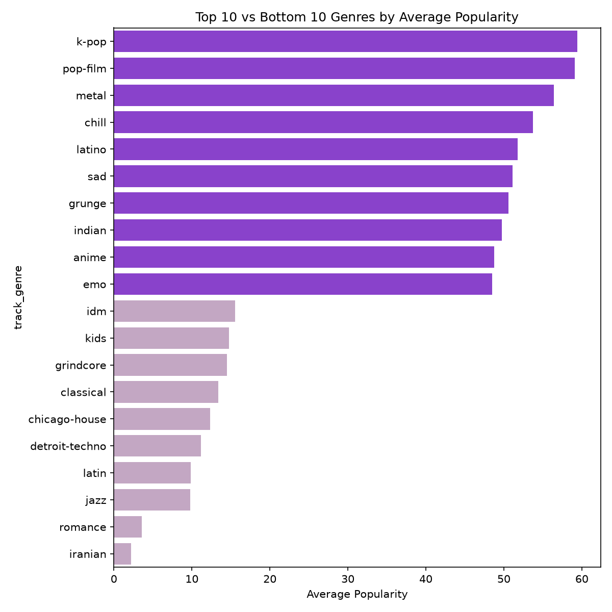
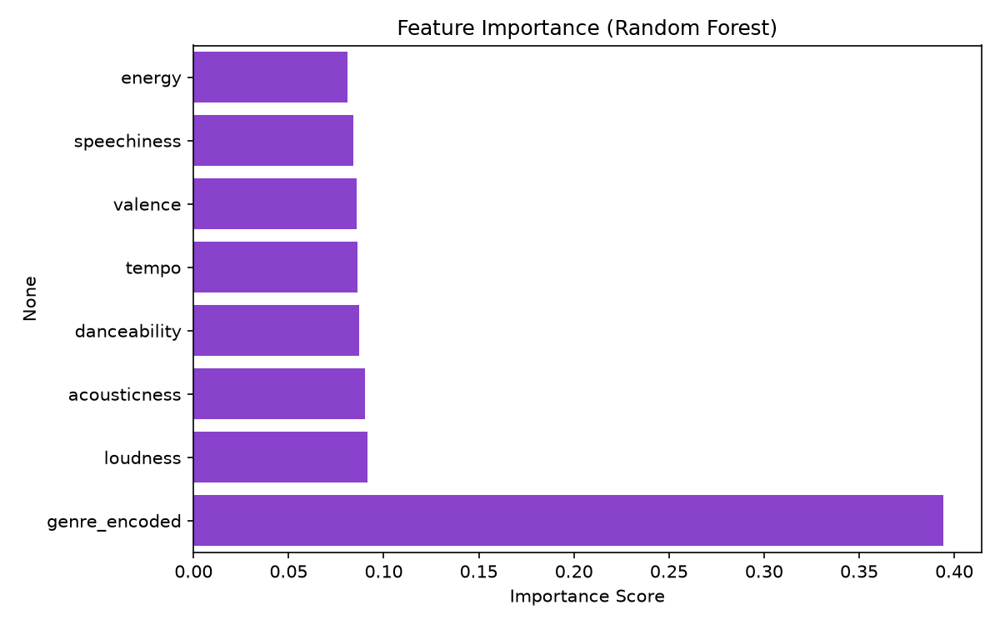

# Spotify Track Popularity Analysis

Analyzes ~90,000 unique Spotify tracks to understand what actually drives song popularity, and builds a model to predict it. **Key finding: genre explains popularity far better than any individual audio feature** — audio characteristics alone (danceability, tempo, energy, etc.) are weak predictors, while genre captures roughly 57 points of variation on a 0–100 popularity scale.

## The Question

Can a song's popularity be predicted from its acoustic characteristics — danceability, tempo, energy, valence, loudness? Or are other factors (genre, promotion, cultural moment) doing most of the work?

## Data Source

- **Dataset:** [Spotify Tracks Dataset](https://www.kaggle.com/datasets/maharshipandya/-spotify-tracks-dataset) (Kaggle, by Maharshi Pandya)
- **Size:** 114,000 rows, 21 columns → 89,740 unique tracks after deduplication
- **Features:** popularity, duration, explicit flag, danceability, energy, key, loudness, mode, speechiness, acousticness, instrumentalness, liveness, valence, tempo, time signature, genre

### Cleaning decisions (and why)

| Issue | Decision | Reasoning |
|---|---|---|
| 24,259 duplicate `track_id`s | Kept, with two dataset versions | Each duplicate reflects a song genuinely cross-listed under multiple genres — dropping them would erase real information. Used full dataset for genre-level analysis, deduplicated version for modeling. |
| 3 missing values (`artists`, `album_name`, `track_name`) | Dropped those 3 rows | Negligible volume, not worth imputing. |
| 157 tracks with `tempo = 0` | Converted to `NaN`, kept the rows | These were genuine ambient/orchestral tracks (e.g. Max Richter, film scores) where Spotify's beat-detection algorithm couldn't find a steady tempo — a measurement gap, not a fake entry. Dropping the rows would've discarded 17 other valid features per song. |
| 14 tracks under 30 seconds | Kept as-is | Verified these were legitimate short classical movements (e.g. Mozart, Schumann) — real, valid data. |
| 550 tracks over 10 minutes | Kept as-is | Verified these were genuine long-form tracks from genres where extended runtime is standard (Afrobeat, progressive rock, extended remixes). |

## Key Findings (EDA)

![Distribution of track popularity, right-skewed with most tracks scoring low]

Most tracks cluster at low popularity, with relatively few high-popularity outliers — part of why predicting exact popularity is inherently hard.

- **Individual audio features correlate weakly with popularity** — all under 0.1:

  | Feature | Correlation with popularity |
  |---|---|
  | Loudness | 0.072 |
  | Danceability | 0.064 |
  | Energy | 0.014 |
  | Tempo | 0.009 |
  | Valence | -0.012 |
  | Acousticness | -0.039 |
  | Instrumentalness | -0.127 |



- **`mode` (major vs. minor key)** showed a negligible difference in average popularity (33.6 vs 32.9) — not practically meaningful despite being "statistically" different.

- **Genre is the dominant factor.** Average popularity by genre ranges from ~59 (k-pop, pop-film) down to ~2 (iranian) — a ~57-point spread, dwarfing every audio feature tested. This likely reflects external factors genre acts as a proxy for: K-pop's famously active fan-streaming culture, and pop-film's built-in marketing tie-ins — not the music's acoustic properties.



## Modeling

| Model | Features | R² Score |
|---|---|---|
| Linear Regression | Audio features only | Near zero |
| Linear Regression | Audio features + genre (mean-encoded) | 0.331 |
| Random Forest | Audio features + genre (mean-encoded) | 0.465 |

Genre was encoded using **target/mean encoding** (each genre replaced with its average popularity), calculated only on the training set to prevent data leakage.

Random Forest outperformed Linear Regression, suggesting non-linear and conditional relationships in the data (e.g. a feature's effect may depend on genre) that a straight-line model can't capture. Feature importance confirmed `genre_encoded` as the dominant predictor, consistent with the EDA findings.



## Error Analysis

Beyond the overall R² score, I looked at the specific predictions the model got most wrong to understand *why* it fails, not just *how often*.

**Finding:** the model's worst errors were almost all severe underestimates of cross-genre hits — mainstream, globally popular songs (e.g. "Ojitos Lindos" by Bad Bunny, "Gasolina" by Daddy Yankee, "BICHOTA" by KAROL G, "Thunder" by Imagine Dragons) that the model predicted near-zero popularity for, when their actual popularity was 74–98.

**Root cause:** these songs are tagged under multiple genres in the raw data (e.g. a reggaeton hit might also be tagged "latin" or "pop"). During deduplication, `drop_duplicates(keep='first')` arbitrarily kept whichever genre tag appeared first for each `track_id` — not necessarily the genre most representative of the song's actual audience. A hit kept under a lower-popularity genre tag (like "latin," avg. ~52) gets an artificially low genre-encoded baseline, dragging the whole prediction down even though the song is a genuine crossover hit.

**Takeaway:** this is a methodology limitation, not a modeling failure — a future improvement would be encoding genre using each song's *highest*-popularity genre tag, or aggregating across all its tags, rather than keeping an arbitrary one.

## Deployment

The trained model is served through a simple **FastAPI** REST API (`app.py`), so it can be queried outside the notebook rather than only existing as a one-off script.

**Running it locally:**

```bash
pip install -r requirements.txt
uvicorn app:app --reload
```

Then visit `http://127.0.0.1:8000/docs` for an interactive interface to test the `/predict` endpoint directly in the browser.

**Example request** (`POST /predict`):
```json
{
  "danceability": 0.7,
  "energy": 0.6,
  "loudness": -5.5,
  "valence": 0.5,
  "tempo": 120,
  "acousticness": 0.2,
  "speechiness": 0.05,
  "genre": "pop"
}
```

**Example response:**
```json
{
  "predicted_popularity": 67.82,
  "genre_used": "pop",
  "genre_encoded_value": 42.28
}
```

If an unseen/unknown genre is passed, the API falls back to the overall average popularity rather than failing.

## Limitations

An R² of 0.465 means the model explains under half of popularity's variation. This is an expected and honest ceiling — real-world popularity is driven heavily by factors this dataset doesn't contain at all: marketing spend, artist fame, playlist placement, release timing, and viral/cultural moments. A model that predicted popularity near-perfectly from acoustic data alone would be suspicious, not impressive.

## Tools Used

- Python, pandas, numpy
- scikit-learn (LinearRegression, RandomForestRegressor, train_test_split)
- matplotlib / seaborn (visualization)
- joblib (model persistence)
- FastAPI / uvicorn (deployment)
- Jupyter Notebook

## How to Run

**Analysis:**
1. Clone this repo
2. Install dependencies: `pip install -r requirements.txt`
3. Download the dataset from Kaggle (link above) and place `dataset.csv` in the project folder
4. Open and run `spotify_analysis.ipynb` in Jupyter

**API:**
1. Ensure `popularity_model.pkl` and `genre_means.pkl` exist (generated by running the notebook)
2. Run `uvicorn app:app --reload`
3. Visit `http://127.0.0.1:8000/docs` to test predictions locally on your computer.

---

*This project was built as a learning exercise in end-to-end data analysis — from messy real-world data through cleaning, exploration, and modeling.*
